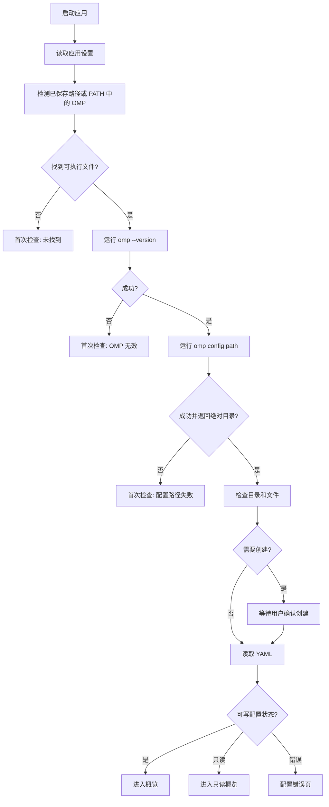
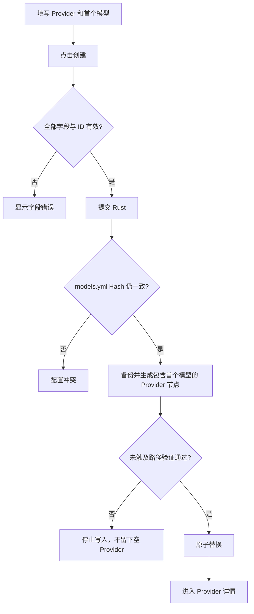

# OMP Switch MVP 交互 Flow

> 版本：v0.1  
> 状态：已确认，原型已批准，待实现
> 对应文档：`docs/mvp.md`、`docs/prd.md`

## 1. 文档职责

本文档描述 MVP 的页面状态、交互步骤、确认文案和错误恢复路径。

- 产品范围以 MVP 为准。
- 产品规则以 PRD 为准。
- 本文不得改变上游规则。
- 已批准视觉权威为 `designs/omp-switch.pen`；最终布局、视觉、间距、颜色、组件和状态表现必须 1:1 还原。
- 除操作系统原生窗口控件、文件选择器、路径格式和快捷键标签外，不允许以“平台中立”或组件库默认样式为由偏离 `.pen` 设计。

## 2. 页面与路由

```text
首次检查
主界面
├── 概览
├── Providers
│   └── Provider 详情
├── 角色
└── 设置
```

建议路由：

```text
/setup
/overview
/providers
/providers/:providerId
/roles
/settings
```

新增 Provider 使用 `.pen` 中的两步创建流程；新增模型使用对应侧边 Sheet。形态、尺寸、层级、遮罩和操作区必须按设计 1:1 还原。

## 3. 主界面

平台中立结构：

```text
┌──────────────────────────────────────────────────────────────┐
│ 应用标题 / 当前配置状态                                     │
├──────────────┬───────────────────────────────────────────────┤
│ 概览         │ 页面标题                         页面主操作   │
│ Providers    ├───────────────────────────────────────────────┤
│ 角色         │                                               │
│ 设置         │                  页面内容                     │
│              │                                               │
│ OMP 状态     │                                               │
└──────────────┴───────────────────────────────────────────────┘
```

侧边栏底部显示：

```text
● OMP 可用 / 不可用
版本
配置目录状态
```

点击状态区进入设置页 OMP 区域。

## 4. 全局交互规则

### 4.1 未保存修改

离开页面、关闭 Dialog/Sheet 或切换 OMP 前，如果存在未保存修改：

```text
有未保存的修改

离开后，这些修改将会丢失。

[继续编辑] [放弃修改]
```

不提供“保存并离开”。

### 4.2 保存按钮

| 状态 | 行为 |
|---|---|
| 无修改 | 禁用 |
| 校验失败 | 禁用 |
| 可保存 | 启用 |
| 保存中 | Loading，禁止重复提交 |
| 成功 | 关闭编辑器或刷新数据 |
| 失败 | 保留输入并显示详细错误 |

快捷键：

```text
Cmd/Ctrl + S    保存当前表单
Esc             关闭当前 Dialog/Sheet
Cmd/Ctrl + F    聚焦当前页面搜索框
```

### 4.3 表单校验

- Blur 后校验当前字段。
- 提交时校验全部字段。
- 错误显示在字段附近。
- 修正后立即移除错误。
- 不在输入过程中同时展示大量错误。

### 4.4 删除

所有删除都需要确认。确认内容必须说明：

- 删除对象。
- 影响范围。
- 受影响角色。
- 是否存在其他引用阻止删除。
- 将创建备份。

### 4.5 只读状态

只读对象必须明确显示原因，例如：

```text
此 Provider 包含当前版本不支持的高级配置，只能查看。
```

只读不等于错误；页面仍显示安全的非敏感摘要。

## 5. 应用启动



启动时先检查未完成配置事务：

- 所有目标匹配最终 Hash：完成事务清理。
- 否则保存现场副本，并从同一事务备份恢复全部文件。
- 恢复完成后显示恢复结果，再进入正常配置读取。

## 6. 首次检查页面

页面不显示主侧边栏。

### 6.1 未找到 OMP

```text
设置 OMP

未在系统 PATH 中找到 OMP。

[自动检测] [手动选择 OMP]
```

### 6.2 检测中

```text
正在检测 OMP…

检查可执行文件
获取版本
获取配置目录
```

禁用重复检测和进入应用。

### 6.3 检测成功

```text
OMP 已找到

可执行文件    /path/to/omp
版本          17.x.x
配置目录      /resolved/agent-dir
models.yml    正常 / 缺失 / 只读
config.yml    正常 / 缺失 / 只读

[进入应用]
```

成功页点击“重新检测”时，保留当前 OMP 信息作为背景，不切换回初始检测页。窗口级半透明模糊遮罩覆盖页面，并在窗口中心单独显示带边框和阴影的 Dot Matrix 加载面板及“正在重新检测 OMP”文案；反馈至少展示 1200ms。期间禁用“重新检测”和“进入应用”，防止重复操作。

### 6.4 `omp config path` 失败

```text
无法获取 OMP 配置目录

OMP 没有成功返回配置路径。OMP Switch 不会猜测目录。

[查看详情] [重新检测] [重新选择 OMP]
```

技术详情可以显示退出码和脱敏 stderr。

实现状态（issue #4）：检测成功页由 Rust 返回的可执行文件、版本、权威配置目录、目标访问性和 `models.yml` / `config.yml` 状态驱动；前端不推导配置目录，也不执行命令。缺失文件会禁用“进入应用”，初始化仍由后续文件发现/初始化工单按 6.5 完成。

### 6.5 缺失目录或文件

```text
需要创建 OMP 配置

将创建：
/path/to/agent-dir/
/path/to/agent-dir/models.yml
/path/to/agent-dir/config.yml

已有文件不会被覆盖。

[取消] [创建]
```

创建后重新检测。

### 6.6 `.yaml` 或旧 JSON

只有 `.yaml`：

```text
当前配置使用 .yaml

OMP Switch MVP 只写入 .yml。当前配置可以查看，但不能修改。

[进入只读模式] [打开配置目录]
```

只有旧 JSON：

```text
需要先由 OMP 迁移配置

请先使用当前 OMP 完成官方 YAML 迁移，然后重新检测。

[重新检测] [打开配置目录]
```

### 6.7 YAML 格式错误

```text
无法读取 models.yml

第 18 行附近存在格式错误。
请在外部修复后重新读取。

[查看详情] [打开配置目录] [重新读取]
```

不允许写入错误文件。

实现状态（issue #5）：6.5–6.7 共用 `02 Page / Setup Success` 的检测表格、状态行、间距体系和操作区，仅按状态替换文案、状态色、路径清单和恢复操作。根据实际窗口缩放反馈，最外层整页卡片装饰已移除，内容在 1100 × 720 最小窗口内响应式收缩；该无外层卡片布局已由产品负责人确认。窗口标题继续由 Tauri 原生窗口组件提供，页面不绘制第二套标题栏。
实现状态（issue #6）：概览通过 Rust application service 的 `get_overview` 读取当前 OMP 返回的真实 Target configuration，保留两份 YAML 完整解析树和原始内容 Hash，仅把安全 Provider、Model definition 与 Model role 摘要投影给 React；Direct API Key 只返回 `hasApiKey` 元数据。React 概览复用 `.pen` 的共享 token 和骨架，覆盖 Loading、Empty、Error、Normal、Read-only，侧边栏状态区进入设置页；窗口标题继续使用 Tauri 原生窗口装饰，页面不绘制第二套标题栏。


## 7. 概览页面

### 7.1 正常状态

```text
概览

OMP 状态
已连接 · v17.x.x
配置目录 /resolved/agent-dir

自定义 Provider    4
模型               12
已配置角色         10

快速测试
Provider   [dnslin ▾]
模型       [gpt-5.6-sol ▾]
有效协议   openai-responses · 模型指定
最终地址   https://example.com/v1/responses

[测试模型]
```

不提供启动 OMP、终端、会话或工作目录入口。

### 7.2 当前选择

选择 Provider：

- 更新模型列表。
- 之前模型不属于新 Provider 时清空模型。
- 保存轻量选择状态。

选择模型：

- 显示有效协议、来源、最终地址和模型能力。
- 保存轻量选择状态。

保存的选择不存在时清除并提示：

```text
之前选择的模型已不存在，请重新选择。
```

### 7.3 空状态

没有 Provider：

```text
还没有可管理的自定义 Provider

创建一个 Provider，并同时配置它的第一个模型。

[新增 Provider]
```

只有只读 override 或高级 Provider 时：

```text
没有可编辑的自定义 Provider

当前配置包含只读的 OMP 覆盖或高级 Provider。

[查看 Providers]
```

## 8. Providers 页面

### 8.1 列表

```text
Providers                                      [新增 Provider]

[搜索 Provider…]

名称 / ID       Base URL       协议默认值       模型   状态
```

状态：

- 正常。
- 配置不完整。
- 高级配置，只读。
- 内置 Provider/模型覆盖，只读。
- 不支持凭据，只读或待替换。

### 8.2 搜索

范围：

- Provider ID。
- Base URL。
- 默认协议。

无结果：

```text
没有找到匹配的 Provider
[清除搜索]
```

### 8.3 只读 Provider

列表项显示锁定标记和原因。进入详情后：

- 展示安全摘要。
- 不返回 Header、命令或其他敏感高级值。
- 禁用编辑和测试。

当前 OMP 版本没有 bundled Provider 清单时：

```text
无法验证 OMP 内置 Provider 目录

当前 OMP 版本尚未包含在 OMP Switch 的 bundled Provider 清单中。
为避免覆盖内置 Provider，Provider 和模型管理暂时只读。

[查看详情] [重新检测]
```

## 9. 新增 Provider 和首个模型

新增使用一个分步 Dialog/Sheet：

```text
步骤 1 / 2 · Provider

Provider ID
[                              ]

Base URL
[                              ]

默认协议（可选）
[由模型指定                  ▾]

认证方式
(●) API Key
( ) 无需认证

API Key
[••••••••••••••••••••          ]

[取消] [下一步]
```

第二步复用新增模型字段：Model ID、名称、协议、能力、Context Window、Max Tokens 和最终地址预览。

```text
[返回] [创建 Provider]
```

### 9.1 Provider ID

- 去除首尾空白。
- 实时检查不区分大小写冲突。
- 检查 bundled Provider 冲突。
- 创建后不可修改。

错误示例：

```text
Provider ID 与现有 Provider 或 OMP 内置 Provider 冲突。
```

### 9.2 Base URL

- 去除首尾空白和末尾 `/`。
- 不补 API 版本路径。
- 不删除用户路径前缀。

### 9.3 创建流程



成功提示：

```text
Provider 和首个模型已创建
```

## 10. Provider 详情

```text
← Providers

dnslin                              [编辑 Provider] [删除]
https://example.com/v1
默认协议：由模型指定
API Key：已配置
模型：4

[搜索模型…]                           [新增模型]
```

Provider ID 只读。

### 10.1 编辑 Provider

API Key 区域：

```text
API Key
已配置

[输入新的 API Key 以替换]
[                              ]

[删除 API Key]
```

- 空输入保留。
- 新输入替换。
- 删除使用单独确认。
- 新值以 `!` 开头时显示不支持错误。

已有命令凭据：

```text
当前 Provider 使用不受支持的命令凭据。
OMP Switch 不会显示或执行该命令。

[替换为文本 API Key]
```

高级 Custom Provider 详情仍可提供“删除完整 Provider”，确认文案说明模型和未知字段会一起删除。OMP 内置 Provider/模型覆盖不显示普通删除入口。

### 10.2 删除 Provider

```text
删除 Provider？

将删除 dnslin 和它下面的 4 个模型。
以下角色会被清除：default、plan、advisor

正在检查 config.yml 中的其他引用…

此操作会创建备份。

[取消] [删除 Provider]
```

发现其他引用：

```text
无法删除 Provider

以下配置仍引用该 Provider：
retry.fallbackChains["dnslin/*"]

OMP Switch 不会修改该路径。请先在 OMP 或外部编辑器中处理引用。

[关闭] [打开配置目录]
```

## 11. 模型列表与表单

### 11.1 列表

```text
名称          Model ID       有效协议              能力              Context   状态
GPT 5.6 Sol   gpt-5.6-sol    openai-responses      Text · Reasoning   400K      正常
```

操作：测试、编辑、复制、删除。只读模型只保留查看和删除。

### 11.2 新增模型

```text
新增模型

Model ID
[                              ]

名称
[                              ]

协议
[继承 Provider               ▾]

能力
[x] Text
[ ] Image
[ ] Reasoning

Context Window
[400000                        ]

Max Tokens
[128000                        ]

最终地址
https://example.com/v1/responses

[取消] [保存模型]
```

Model ID 创建后不可修改。

### 11.3 校验

- Text / Image 至少一个。
- Context Window 和 Max Tokens 是正整数。
- Max Tokens 大于 Context Window 时禁止保存：

```text
Max Tokens 不能大于 Context Window。
```

- 有效协议为空时禁止保存：

```text
请选择模型协议，或为 Provider 设置默认协议。
```

### 11.4 不完整模型

```text
配置不完整

此模型缺少 OMP Switch 表单需要的字段。
补齐后才能保存、测试或分配新角色。

[补齐配置]
```

### 11.5 只读模型

```text
此模型包含当前版本不支持的配置，只能查看。
```

不展示敏感高级字段值。删除使用普通删除确认，完整模型节点会被删除。

### 11.6 复制模型

```text
复制普通模型
→ 生成不区分大小写无冲突的临时 ID
→ 打开新增表单
→ 用户保存后写入
```

只读模型不可复制。

### 11.7 删除模型

```text
删除模型？

将删除 dnslin/gpt-5.6-sol。
以下角色会被清除：default、advisor
此操作会创建备份。

[取消] [删除模型]
```

其他引用存在时阻止，行为与 Provider 删除一致。

## 12. 模型测试

### 12.1 入口

- 概览。
- Provider 详情模型列表。
- 已保存模型的编辑表单。

不可测试：

- 未保存模型。
- 不完整模型。
- 不支持协议模型。
- 高级 Provider 或模型。
- 自定义 Header Provider。
- 未替换的命令凭据 Provider。

第一次测试时先显示：

```text
模型测试会向 Provider 发起真实 API 请求，可能产生费用。

[取消] [继续测试]
```

确认后不再重复显示；测试仍由用户每次手动发起。

### 12.2 单并发

测试开始：

```text
按钮进入 Loading
→ 全应用其他测试按钮禁用
→ 显示取消
```

其他位置提示：

```text
已有模型测试正在进行。
```

### 12.3 成功

```text
测试成功

模型      dnslin/gpt-5.6-sol
协议      openai-responses
最终地址  https://example.com/v1/responses
耗时      842 ms
状态码    200
```

Sonner：

```text
模型连接成功 · 842 ms
```

### 12.4 失败

```text
连接失败

无法连接到 https://example.com/v1/responses。
请检查 Base URL、网络或服务状态。

错误类型：连接失败
```

Sonner 只显示“模型测试失败”。

### 12.5 取消

```text
取消请求
→ 按钮恢复
→ 页面显示“测试已取消”
```

取消不作为错误。

### 12.6 结果生命周期

- 只保留当前运行期间最近一次脱敏结果。
- 应用重启后不恢复。
- 不写入 OMP 配置。
- 不保存完整请求或响应。

## 13. 角色页面

### 13.1 正常状态

```text
角色                                  [新增自定义角色] [保存修改]

角色        Provider       模型             Thinking       状态       操作
default     [dnslin ▾]     [gpt-5.6 ▾]      [max ▾]        正常       [清除]
advisor     [dnslin ▾]     [gpt-5.6 ▾]      [max ▾]        正常       [清除]
researcher  [dnslin ▾]     [gpt-5.6 ▾]      [high ▾]       自定义     [···]
```

### 13.2 Thinking Level

选项：

```text
模型默认
off
minimal
low
medium
high
xhigh
max
auto
```

不显示 `ultra`。

“模型默认”保存为无后缀选择器。

### 13.3 自定义角色

新增：

```text
新增自定义角色

角色名称
[researcher                    ]

Provider
[dnslin                      ▾]

模型
[gpt-5.6-sol                 ▾]

Thinking
[high                        ▾]

[取消] [添加]
```

支持改名、编辑和删除。保存时只定点修改对应 `modelRoles` 键。

内置角色不能改名或删除，只能设置或清除。自定义角色的更多菜单包含：

```text
编辑
改名
删除
```

自定义角色名不能与内置角色或现有自定义角色重复。

删除自定义角色：

```text
删除自定义角色？

将删除角色 researcher 及其模型选择器。
Provider 和模型配置不会被删除。

[取消] [删除角色]
```

删除只移除对应 `modelRoles` 键；保存前仍可通过“放弃修改”撤销。

### 13.4 高级配置只读

任一角色使用别名、数组、多候选、未知后缀或无法解析值时：

```text
角色配置为只读

以下角色使用当前版本不支持的高级选择器：
researcher

为避免部分覆盖，整个角色页面暂时不能修改。

[打开配置目录]
```

### 13.5 无效简单引用

```text
default
Provider：dnslin
模型：old-model
状态：模型不存在

[重新选择] [清除]
```

不自动修改。保存其他角色时，如果页面不是高级只读状态，则未操作的无效引用原样保留。

### 13.6 清除全部

```text
清除全部内置角色？

将清除 default、smol、slow、vision、plan、designer、commit、tiny、task 和 advisor 的模型选择器。
自定义角色不受影响。
本操作只修改表单，仍需点击“保存修改”。

[取消] [清除]
```

## 14. 设置页面

区域：

```text
OMP
外观
目录
应用信息
```

### 14.1 OMP

```text
OMP 可执行文件
/path/to/omp
[重新选择] [使用系统 PATH]

版本
17.x.x

权威配置目录
/resolved/agent-dir

[重新检测]
```

使用系统 PATH 时先检测成功，再清除旧路径。

### 14.2 外观

```text
跟随系统
浅色
深色
```

立即生效并自动保存。

### 14.3 目录

- 打开 OMP 配置目录。
- 打开应用配置目录。
- 打开应用日志目录。
- 打开备份目录。

目录路径不可直接编辑。

### 14.4 恢复默认设置

```text
恢复应用默认设置？

将恢复主题、OMP 路径和当前选择项。
不会删除 OMP Provider、模型、角色、API Key 或备份。

[取消] [恢复默认]
```

## 15. 配置冲突

```text
配置文件已经发生变化

models.yml 在当前表单打开后被其他程序修改。
为避免覆盖最新内容，本次保存已停止。
重新加载后，当前未保存修改会丢失。

[取消] [重新加载]
```

取消：保留表单，不保存。  
重新加载：关闭编辑器、读取最新配置、刷新页面并提示“配置已重新加载”。

## 16. 写入和事务失败

### 16.1 单文件失败

```text
保存失败

无法安全写入 models.yml。
原配置文件没有被修改。

[查看详情] [关闭]
```

表单保持打开。

### 16.2 未触及路径变化

```text
保存已停止

序列化后的配置改变了用户未操作的数据。
OMP Switch 没有替换原文件。

[查看详情] [关闭]
```

### 16.3 事务恢复

启动时恢复成功：

```text
配置事务已恢复

上次操作在写入过程中中断。
models.yml 和 config.yml 已从同一事务备份恢复。
现场副本已保存在事务目录。

[打开备份目录] [继续]
```

目标已全部提交但清理中断：

```text
上次配置操作已经完成，事务记录已清理。
```

## 17. 加载、空状态和错误状态

### Loading

- 页面标题保持。
- 内容使用 Skeleton。
- 主要操作禁用。

### Empty

必须说明下一步，不使用“暂无数据”作为唯一文案。

### Error

包含：

- 错误标题。
- 简短原因。
- 建议操作。
- 重试或打开目录入口。

### 无搜索结果

```text
没有找到匹配内容
[清除搜索]
```

## 18. 通知文案

成功：

```text
Provider 和首个模型已创建
Provider 已保存
Provider 已删除
模型已保存
模型已删除
角色配置已保存
配置已重新加载
```

警告：

```text
当前模型已不存在
OMP 路径已失效
当前配置只读
发现其他模型引用
```

错误：

```text
保存失败
模型测试失败
无法读取配置
无法获取配置目录
无法打开目录
```

Sonner 不显示长段错误或敏感值。

## 19. 键盘和动画

### 键盘

- Dialog/Sheet 打开后聚焦第一个可编辑字段。
- Tab 遵循视觉顺序。
- Esc 关闭；有修改时先确认。
- 删除确认默认焦点在取消按钮。
- Cmd/Ctrl + S 保存。
- Cmd/Ctrl + F 聚焦页面搜索框。

### 动画

允许：

- 页面内容轻微过渡。
- Dialog/Sheet 出现和关闭。
- 状态、错误和测试结果出现。
- 侧边栏选中态。

不允许：

- 大面积背景动画。
- 长时间装饰动画。
- 影响点击速度的过渡。

系统减少动画时关闭非必要动画。

### 视觉实现与验收

- 实现前从 `designs/omp-switch.pen` 读取当前画板、变量和组件；不得依据过期截图或本文 ASCII 示意猜测视觉细节。
- `00 Foundations` 中的变量必须映射为应用设计 token；`01 Components` 中的可复用组件必须映射为共享 UI 组件，禁止为不同页面建立第二套外观。
- 页面实现按对应 `.pen` 画板逐一完成。每个页面工单关闭前，在 1536×1024 运行真实 Tauri 页面并截图，与 Pencil 对应节点导出截图对比。
- 对比范围包括布局、尺寸、对齐、间距、字体、字号、字重、颜色、圆角、边框、阴影、图标、文案、组件状态、遮罩、Dialog/Sheet 和表格密度。
- 视觉对比不是只检查“风格相似”。存在肉眼可见且未获批准的偏差即不满足验收；必须修复实现，或先修改并重新批准 `.pen` 设计。
- 动态数据长度和操作系统原生控件允许出现内容驱动或平台驱动差异，但必须保留设计的排版规则、截断策略、最小尺寸和视觉层级。

## 20. 原型状态清单

### 首次检查

- `01-Setup-Detecting`
- `02-Setup-NotFound`
- `03-Setup-Success`
- `04-Setup-MissingConfig`
- `05-Setup-ConfigPathError`
- `06-Setup-YamlReadonly`
- `07-Setup-LegacyJson`
- `08-Setup-ConfigError`

### 概览

- `10-Overview-Normal`
- `11-Overview-NoEditableProvider`
- `12-Overview-NoModel`
- `13-Overview-Readonly`
- `14-Overview-Testing`
- `15-Overview-TestSuccess`
- `16-Overview-TestFailed`

### Providers

- `20-Providers-List`
- `21-Providers-Empty`
- `22-Providers-SearchEmpty`
- `23-Provider-Create`
- `24-Provider-CreateError`
- `25-Provider-Detail`
- `26-Provider-Edit`
- `27-Provider-ReadonlyAdvanced`
- `28-Provider-BundledOverride`
- `29-Provider-DeleteConfirm`

### 模型

- `30-Models-List`
- `31-Models-Empty`
- `32-Model-Create`
- `33-Model-Edit`
- `34-Model-Incomplete`
- `35-Model-ReadonlyAdvanced`
- `36-Model-ReadonlyProtocol`
- `37-Model-Duplicate`
- `38-Model-DeleteConfirm`
- `39-Model-DeleteBlockedReference`
- `40-Model-TestRunning`
- `41-Model-TestSuccess`
- `42-Model-TestFailed`

### 角色

- `50-Roles-Normal`
- `51-Roles-Dirty`
- `52-Roles-InvalidReference`
- `53-Roles-CustomCreate`
- `54-Roles-CustomEdit`
- `55-Roles-AdvancedReadonly`
- `56-Roles-ClearAllConfirm`

- `57-Roles-CustomDeleteConfirm`
- `58-Catalog-ReadonlyFailure`

### 设置与通用

- `60-Settings-Normal`
- `61-Settings-ChangeOmp`
- `62-Settings-ConfigPathFailure`
- `63-Settings-ResetConfirm`
- `70-UnsavedChanges`
- `71-ConfigConflict`
- `72-WriteFailed`
- `73-TransactionRecovered`
- `74-DeleteApiKey`
- `75-CreateConfigConfirm`

## 21. 可点击原型路径

### 路径一：首次使用

```text
首次检查
→ 自动检测
→ 配置目录成功
→ 确认创建缺失文件
→ 概览空状态
```

### 路径二：创建 Provider 和模型

```text
概览空状态
→ 新增 Provider
→ 填写 Provider
→ 填写首个模型
→ 一次保存
→ Provider 详情
→ 模型列表
```

### 路径三：模型测试

```text
Provider 详情
→ 测试
→ 测试中
→ 成功或失败
→ 查看脱敏详情
```

### 路径四：自定义角色

```text
角色页
→ 新增自定义角色
→ 选择模型和 Thinking
→ 保存
```

### 路径五：删除被角色引用的模型

```text
模型菜单
→ 删除
→ 显示角色影响
→ 扫描其他引用
→ 确认
→ 跨文件事务
→ 列表刷新
```

### 路径六：其他引用阻止删除

```text
删除模型
→ 发现 retry.fallbackChains 引用
→ 阻止删除
→ 显示配置路径
```

### 路径七：配置冲突

```text
编辑 Provider
→ 外部修改 models.yml
→ 保存
→ Hash 冲突
→ 重新加载
```

### 路径八：事务恢复

```text
删除模型
→ 写入中断
→ 重启应用
→ 保存现场副本
→ 恢复全部文件
→ 显示恢复结果
```

## 22. Flow 验收

- [ ] 每条交互与 MVP、PRD 一致。
- [ ] 页面不出现启动 OMP、终端、会话、项目配置或 Profile 管理。
- [ ] OMP 路径失败时不猜目录。
- [ ] `.yaml` 和旧 JSON 不会被误写。
- [ ] 普通、高级、不支持、不完整和 bundled override 状态可区分。
- [ ] ID 创建后没有编辑入口。
- [ ] 四种协议和继承来源显示清楚。
- [ ] Thinking 不出现 `ultra`。
- [ ] 高级角色配置使整个角色页只读。
- [ ] 删除显示引用检查和事务行为。
- [ ] 模型测试为手动单并发，不泄露敏感内容。
- [ ] Loading、Empty、Error、Normal、Read-only 状态完整。
- [ ] `designs/omp-switch.pen` 的 Foundations、Components 和全部适用页面/Sheet 状态已在 1536×1024 基准视口 1:1 还原，并完成逐页截图对比。
