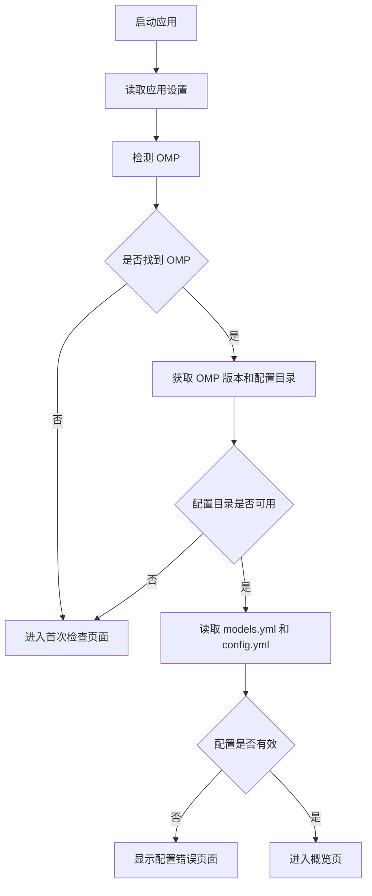
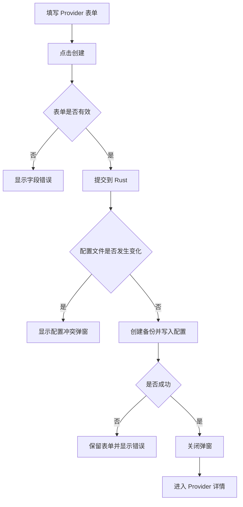
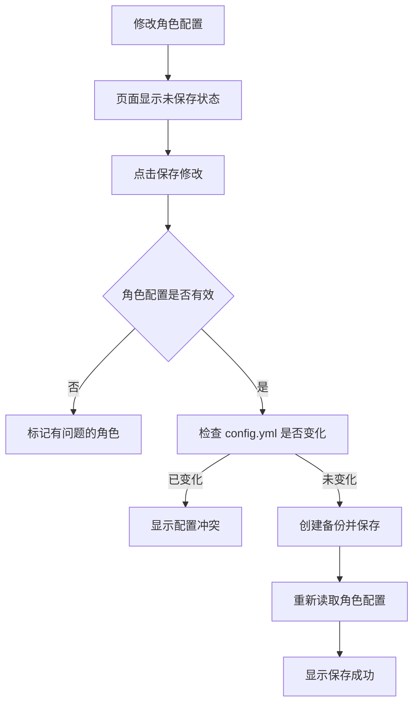

# OMP Switch 第一阶段原型交互 Flow

> 版本：v0.1  
> 对应文档：OMP Switch 第一阶段 MVP / PRD  
> 用途：指导高保真原型设计和页面交互实现

---

## 1. 原型范围

第一阶段原型包含：

- OMP 环境检测
- 概览
- 自定义 Provider 管理
- API Key 管理
- 模型管理
- 模型连接测试
- 模型角色配置
- OMP 配置文件状态
- 应用设置
- 配置冲突和错误提示

第一阶段原型不包含：

- 启动 OMP
- 终端功能
- 工作目录
- 会话功能
- 模型自动发现
- Skills
- Provider 预设
- OAuth
- 自动更新

---

## 2. 页面结构

```text
首次检查
主界面
├── 概览
├── Providers
│   └── Provider 详情
├── 角色
└── 设置
```

建议路由：

```text
/setup
/overview
/providers
/providers/:providerId
/roles
/settings
```

Provider 和模型的新增、编辑使用表单弹窗。

弹窗采用接近 macOS Sheet 的样式，不使用占满屏幕的 Web 表单页面。

---

## 3. 主界面布局

```text
┌──────────────────────────────────────────────────────────────┐
│ 窗口标题栏                                                   │
├──────────────┬───────────────────────────────────────────────┤
│              │ 页面标题                         页面操作按钮 │
│  概览        ├───────────────────────────────────────────────┤
│  Providers   │                                               │
│  角色        │                 页面内容                      │
│  设置        │                                               │
│              │                                               │
│              │                                               │
│ OMP 状态     │                                               │
└──────────────┴───────────────────────────────────────────────┘
```

### 侧边栏

固定显示：

- 概览
- Providers
- 角色
- 设置

侧边栏底部显示 OMP 状态：

```text
● OMP 已连接
v0.x.x
```

异常时显示：

```text
● OMP 不可用
重新检查
```

点击状态区域进入设置页的 OMP 设置部分。

### 页面标题区域

标题区域包含：

- 当前页面名称
- 简短说明
- 当前页面主要操作

例如 Providers 页面右上角显示：

```text
[新增 Provider]
```

Provider 详情页显示：

```text
[编辑 Provider] [删除]
```

---

## 4. 全局交互规则

### 4.1 页面跳转

点击侧边栏项目后切换页面。

如果当前页面存在未保存内容，先显示确认弹窗：

```text
有未保存的修改

离开当前页面后，这些修改将会丢失。

[继续编辑] [放弃修改]
```

不在该弹窗中增加“保存并离开”，避免交互过于复杂。

---

### 4.2 保存按钮

保存按钮有以下状态：

| 状态 | 按钮表现 |
|---|---|
| 没有修改 | 禁用 |
| 表单有错误 | 禁用 |
| 可以保存 | 正常 |
| 正在保存 | Loading，禁止重复点击 |
| 保存成功 | 关闭弹窗或刷新页面 |
| 保存失败 | 保留表单内容并显示错误 |

保存成功统一显示 Sonner：

```text
Provider 已保存
```

保存失败显示：

```text
保存失败

配置文件已被其他程序修改，请重新加载后再试。
```

---

### 4.3 表单校验

表单输入时不立即显示大量错误。

建议规则：

- 用户离开输入框时检查当前字段。
- 点击保存时检查全部字段。
- 错误显示在对应字段下方。
- 修正内容后错误立即消失。

示例：

```text
Provider ID
[ openai-main ]

Provider ID 已存在
```

---

### 4.4 删除操作

所有删除操作需要确认。

普通删除弹窗包含：

- 删除对象名称
- 影响范围
- 取消按钮
- 删除按钮

删除按钮使用危险色。

---

### 4.5 敏感信息

API Key 输入框：

- 默认使用密码显示。
- 可以按住或点击图标临时查看。
- 关闭表单后清空前端输入值。
- 编辑 Provider 时不显示已保存的 API Key。
- 使用“已配置”状态表示已有密钥。

---

## 5. 应用启动流程



### 正常启动

用户之前已经完成过设置，且 OMP 可用：

```text
启动应用
→ 显示简短加载状态
→ 自动进入概览页
```

不需要每次都显示首次检查页面。

### 启动失败

以下情况进入首次检查页面：

- 找不到 OMP
- 用户设置的 OMP 路径已失效
- 无法执行 OMP
- 无法获取配置目录
- 配置目录无读取权限
- OMP 版本不支持

### 配置格式错误

OMP 可以正常检测，但 YAML 配置无法读取时：

```text
启动应用
→ 检测 OMP 成功
→ 读取配置失败
→ 显示配置错误页面
```

此时允许用户：

- 打开配置目录
- 重新读取
- 返回设置 OMP 路径

不允许进入 Provider、模型和角色编辑页面。

---

## 6. 首次检查页面

### 6.1 默认状态

```text
设置 OMP

OMP Switch 需要连接到本机已经安装的 OMP。

OMP 可执行文件
[ 自动检测                             ]

[自动检测] [手动选择]
```

页面不显示侧边栏。

---

### 6.2 自动检测流程

```text
点击“自动检测”
→ 按钮进入 Loading
→ 检查系统 PATH
→ 执行 omp --version
→ 执行 omp config path
→ 检查配置目录
→ 显示检测结果
```

#### 检测成功

```text
OMP 已找到

可执行文件
/usr/local/bin/omp

版本
0.x.x

配置目录
/Users/name/.omp/agent

models.yml       正常
config.yml       正常
目录权限          可读写

[进入应用]
```

点击“进入应用”：

```text
读取配置
→ 进入概览页
```

---

### 6.3 手动选择 OMP

```text
点击“手动选择”
→ 打开系统文件选择器
→ 用户选择文件
→ Rust 检查文件是否可执行
```

检查成功后显示检测结果。

检查失败时：

```text
所选文件不是有效的 OMP 可执行文件。

[重新选择]
```

---

### 6.4 配置文件不存在

如果配置目录存在，但 `models.yml` 或 `config.yml` 不存在：

```text
models.yml       未找到
config.yml       正常

缺少的配置文件可以由 OMP Switch 创建。

[创建配置文件]
```

点击后显示确认弹窗：

```text
创建基础配置文件？

将会在 OMP 配置目录中创建 models.yml。
已有文件不会被覆盖。

[取消] [创建]
```

创建成功后重新检查环境。

---

### 6.5 配置格式错误

```text
无法读取 models.yml

第 18 行附近存在格式错误。
请修复配置后重新读取。

[打开配置目录] [重新读取]
```

错误信息不要直接显示较长的 Rust 或 YAML 原始错误。

可以在“查看详情”中显示技术信息。

---

## 7. 概览页面

### 7.1 正常状态

页面分为三个区域：

```text
OMP 状态
配置统计
快速测试
```

示意：

```text
概览

┌ OMP 状态 ────────────────────────────────────────────────┐
│ 已连接    OMP v0.x.x                                    │
│ 配置目录：~/.omp/agent                                  │
└──────────────────────────────────────────────────────────┘

┌ Provider ───────┐ ┌ 模型 ──────────┐ ┌ 已配置角色 ─────┐
│ 4               │ │ 12             │ │ 8 / 10          │
└─────────────────┘ └────────────────┘ └─────────────────┘

快速测试

Provider
[ openai-main                 ▾ ]

模型
[ gpt-5                       ▾ ]

协议              openai-responses
Context Window    400,000
Reasoning         支持

[测试模型]
```

### 7.2 统计卡片交互

点击 Provider 数量：

```text
跳转 Providers 页面
```

点击模型数量：

```text
跳转 Providers 页面
```

模型没有独立顶层页面。

点击角色数量：

```text
跳转角色页面
```

---

### 7.3 Provider 和模型选择

Provider 选择后：

- 更新模型下拉列表。
- 如果之前选择的模型不属于新 Provider，清空模型。
- 保存当前 Provider 选择到应用设置。

模型选择后：

- 显示模型信息。
- 保存当前模型选择到应用设置。

如果之前保存的模型已被删除：

```text
进入概览页
→ 清除无效选择
→ 显示提示
```

提示内容：

```text
之前选择的模型已不存在，请重新选择。
```

---

### 7.4 没有 Provider

```text
还没有 Provider

创建自定义 Provider 后，可以添加并测试模型。

[创建 Provider]
```

点击后打开新增 Provider 表单。

---

### 7.5 Provider 没有模型

```text
当前 Provider 还没有模型。

[添加模型]
```

点击后进入对应 Provider 详情，并打开新增模型表单。

---

## 8. Providers 页面

### 8.1 正常状态

```text
Providers                                      [新增 Provider]

[搜索 Provider...]

┌────────────────────────────────────────────────────────────┐
│ openai-main                                               │
│ https://api.example.com                                   │
│ openai-responses · 4 个模型 · API Key 已配置              │
│                                              [编辑] [···] │
├────────────────────────────────────────────────────────────┤
│ local-llm                                                 │
│ http://127.0.0.1:11434                                    │
│ openai-completions · 2 个模型 · 无需认证                  │
│                                              [编辑] [···] │
└────────────────────────────────────────────────────────────┘
```

点击 Provider 列表项：

```text
进入 Provider 详情
```

点击“编辑”：

```text
打开编辑 Provider 表单
```

点击更多按钮：

```text
编辑 Provider
删除 Provider
```

---

### 8.2 搜索

搜索范围：

- Provider ID
- Base URL
- API 协议

搜索实时生效。

没有匹配结果时：

```text
没有找到匹配的 Provider

[清除搜索]
```

---

### 8.3 空状态

```text
还没有 Provider

添加一个自定义 Provider，用来管理对应的模型。

[新增 Provider]
```

---

## 9. 新增 Provider

### 9.1 打开方式

以下入口打开同一个新增 Provider 表单：

- Providers 页面右上角
- Providers 空状态
- 概览空状态

表单以 Sheet 风格弹窗显示。

---

### 9.2 表单结构

```text
新增 Provider

Provider ID
[                                  ]

Base URL
[                                  ]

API 协议
[ OpenAI Completions             ▾ ]

认证方式
(●) API Key
( ) 无需认证

API Key
[ ••••••••••••••••••••          👁 ]

                         [取消] [创建 Provider]
```

### 9.3 字段交互

#### Provider ID

- 输入后检查是否重复。
- 去除首尾空格。
- 不自动修改用户输入的中间内容。

#### Base URL

- 去除首尾空格。
- 不自动删除用户配置的路径。
- 不自动拼接 API 路径。

#### API 协议

选项：

```text
OpenAI Completions
OpenAI Responses
Anthropic Messages
```

下方显示简短说明。

#### 认证方式

选择“无需认证”后：

- 隐藏 API Key 输入框。
- 不向配置写入 API Key。

---

### 9.4 创建流程



创建成功后显示：

```text
Provider 已创建
```

---

## 10. Provider 详情页面

### 10.1 页面结构

```text
← Providers

openai-main                       [编辑 Provider] [删除]

https://api.example.com
OpenAI Responses
API Key 已配置

模型 4

[搜索模型...]                                [新增模型]

模型列表
```

### 10.2 Provider 信息区域

显示：

- Provider ID
- Base URL
- API 协议
- 认证方式
- API Key 状态
- 模型数量

API Key 只显示：

```text
已配置
未配置
无需认证
```

不显示部分密钥字符。

---

### 10.3 编辑 Provider

点击“编辑 Provider”打开编辑表单。

编辑表单字段与新增表单基本一致。

API Key 区域显示：

```text
API Key
已配置

[输入新的 API Key 以替换]
[                                  ]

[删除 API Key]
```

规则：

- 输入框留空：保留原 API Key。
- 输入新值：替换原 API Key。
- 点击删除：单独确认后删除。

---

### 10.4 Provider ID 修改

用户修改 Provider ID 时，在保存按钮上方显示提示：

```text
修改 Provider ID 后，相关角色中的模型引用也会同步更新。
```

点击保存前，如果存在受影响角色，显示确认弹窗：

```text
更新 Provider ID？

openai-main 将改为 openai-primary。

以下角色引用将同步更新：
default、plan、advisor

[取消] [更新]
```

确认后一次完成所有更新。

如果其中任何一步失败，不保存部分结果。

---

### 10.5 删除 Provider

点击删除后：

```text
删除 Provider？

将删除 openai-main 和它下面的 4 个模型。

以下角色配置会被清除：
default、plan、advisor

此操作执行前会自动创建备份。

[取消] [删除 Provider]
```

确认后：

```text
创建备份
→ 删除 Provider 和模型
→ 清除对应内置角色
→ 返回 Providers 页面
→ 显示成功提示
```

---

## 11. 模型列表

### 11.1 列表内容

建议使用桌面表格，而不是大卡片。

```text
名称          模型 ID          能力            Context       操作
GPT-5         gpt-5            Text · Reasoning 400K          [测试] [···]
GPT-5 Mini    gpt-5-mini       Text             128K          [测试] [···]
Vision Model  vision-model     Text · Image     64K           [测试] [···]
```

更多菜单：

```text
编辑
复制
删除
```

点击模型名称或模型 ID：

```text
打开编辑模型表单
```

---

### 11.2 搜索和排序

搜索范围：

- 模型名称
- 模型 ID
- 完整模型标识

默认按模型 ID 排序。

搜索结果为空：

```text
没有找到匹配的模型

[清除搜索]
```

---

### 11.3 模型空状态

```text
这个 Provider 还没有模型

手动添加一个模型后，可以进行连接测试和角色配置。

[新增模型]
```

---

## 12. 新增和编辑模型

### 12.1 模型表单

```text
新增模型

模型 ID
[                                  ]

模型名称
[                                  ]

能力
[x] Text
[ ] Image
[ ] Reasoning

Context Window
[ 128000                           ]

Max Tokens
[ 8192                             ]

                         [取消] [保存模型]
```

### 12.2 字段交互

#### 输入能力

- Text 默认选中。
- Text 和 Image 至少选择一个。
- Reasoning 独立选择。

#### Context Window

只允许正整数。

#### Max Tokens

只允许正整数。

当 Max Tokens 大于 Context Window 时：

```text
Max Tokens 不能大于 Context Window
```

---

### 12.3 模型 ID 修改

如果模型已被角色使用，修改 ID 时显示：

```text
修改模型 ID 后，以下角色引用将同步更新：

default
plan

[取消] [继续更新]
```

---

### 12.4 复制模型

点击“复制”：

```text
读取原模型字段
→ 自动生成临时模型 ID
→ 打开新增模型表单
```

例如：

```text
原模型 ID：gpt-5
临时 ID：gpt-5-copy
```

表单标题显示：

```text
复制模型
```

用户点击保存后才写入配置。

---

### 12.5 删除模型

```text
删除模型？

将删除模型 gpt-5。

以下角色配置会被清除：
default、advisor

此操作执行前会自动创建备份。

[取消] [删除模型]
```

删除成功后：

- 关闭确认弹窗。
- 刷新模型列表。
- 显示 Sonner。
- 如果概览当前选择的是该模型，清除概览选择。

---

## 13. 模型测试

### 13.1 测试入口

测试入口：

- 概览页
- Provider 详情模型列表
- 模型编辑弹窗

模型编辑弹窗中的测试只允许在模型已经保存后使用。

新增模型未保存时不提供测试按钮。

---

### 13.2 测试开始

点击测试后：

```text
测试按钮变为 Loading
同一个模型不能重复测试
显示取消按钮
```

模型列表中的表现：

```text
GPT-5     正在测试...                         [取消]
```

概览页中的表现：

```text
[ 正在测试... ] [取消]
```

---

### 13.3 测试成功

测试完成后，页面显示非阻塞结果区域：

```text
测试成功

模型：openai-main/gpt-5
协议：openai-responses
耗时：842 ms
状态码：200
```

同时显示 Sonner：

```text
模型连接成功 · 842 ms
```

---

### 13.4 测试失败

```text
连接失败

无法连接到 https://api.example.com。

请检查 Base URL、网络连接或服务是否已经启动。

错误类型：连接失败
```

同时显示 Sonner：

```text
模型测试失败
```

Sonner 只显示摘要，详细错误保留在页面结果区域。

---

### 13.5 测试取消

用户点击取消：

```text
停止当前请求
→ 按钮恢复正常
→ 显示“测试已取消”
```

取消不作为错误处理。

---

### 13.6 测试结果更新

每次只在当前应用运行期间保留最近一次测试结果。

应用重启后不恢复测试历史。

测试结果不写入 OMP 配置。

---

## 14. 角色页面

### 14.1 页面结构

```text
角色                                           [保存修改]

为 OMP 的不同任务选择默认模型。

角色          Provider           模型             Thinking       状态
default       [openai-main ▾]    [gpt-5 ▾]        [high ▾]       正常
smol          [local-llm ▾]      [small ▾]        [low ▾]        正常
slow          [未配置 ▾]         [—]              [—]            未配置
vision        [openai-main ▾]    [vision ▾]       [medium ▾]     正常
```

每行右侧提供清除按钮。

---

### 14.2 选择 Provider

用户为某个角色选择 Provider 后：

- 模型下拉框只显示该 Provider 的模型。
- 如果之前的模型不属于新 Provider，清空模型。
- 模型字段进入待选择状态。

如果没有选择模型，当前行显示：

```text
请选择模型
```

---

### 14.3 清除角色

点击单行清除：

```text
清空当前 Provider
清空当前模型
清空 Thinking Level
角色状态变为“未配置”
```

单行清除不需要二次确认，保存前可以恢复。

---

### 14.4 清除全部角色

点击页面更多操作中的“清除全部角色”：

```text
清除全部内置角色？

将清除 default、smol、slow、vision、plan、designer、
commit、tiny、task 和 advisor 的模型配置。

[取消] [清除]
```

确认后只修改当前表单。

用户仍需点击“保存修改”才写入配置。

---

### 14.5 设置当前模型为 default

页面顶部可以显示：

```text
当前选择：openai-main/gpt-5
[设为 default]
```

点击后直接修改表单中的 default 行，不立即保存。

如果概览没有当前模型选择，则不显示该按钮。

---

### 14.6 无效角色引用

如果读取到模型已经不存在：

```text
default

Provider：openai-main
模型：old-model

状态：模型不存在

[重新选择] [清除]
```

不要自动修改该角色。

用户保存其他角色时，如果没有处理这条无效配置：

- 保留原值。
- 不主动清除。

只有用户明确重新选择或清除时才更新。

---

### 14.7 未识别角色

如果配置文件中存在自定义角色：

```text
其他角色

researcher
openai-main/gpt-5

当前版本暂不支持编辑该角色。
```

这些内容只读显示。

保存内置角色时不得删除。

---

### 14.8 保存角色



---

## 15. 设置页面

### 15.1 页面结构

```text
设置

OMP
外观
目录
应用信息
```

---

### 15.2 OMP 设置

```text
OMP 可执行文件

/usr/local/bin/omp

[重新选择] [使用系统 PATH]

版本
0.x.x

配置目录
/Users/name/.omp/agent

[重新检测]
```

---

### 15.3 更换 OMP 路径

点击重新选择：

```text
打开文件选择器
→ 选择可执行文件
→ 验证 OMP
→ 获取新的配置目录
```

如果新 OMP 指向不同配置目录，显示确认：

```text
切换 OMP 配置？

新的 OMP 使用不同的配置目录。
切换后，当前 Provider、模型和角色数据会重新加载。

[取消] [切换]
```

确认后：

```text
保存新路径
→ 重新读取配置
→ 返回概览页
```

---

### 15.4 使用系统 PATH

点击后：

```text
清除自定义路径
→ 从 PATH 重新检测 OMP
```

检测失败时不立即丢弃当前可用路径。

建议流程：

```text
先检测 PATH 中的 OMP
→ 检测成功后再清除旧路径
```

---

### 15.5 主题

主题选项：

```text
跟随系统
浅色
深色
```

点击后立即生效并自动保存，不需要额外保存按钮。

---

### 15.6 目录操作

提供：

- 打开 OMP 配置目录
- 打开应用配置目录
- 打开应用日志目录

目录路径不可编辑。

---

### 15.7 恢复默认设置

```text
恢复应用默认设置？

将恢复主题、OMP 路径和当前选择项。

不会删除 OMP Provider、模型、角色或 API Key。

[取消] [恢复默认]
```

恢复成功后重新检测 OMP。

---

## 16. 配置冲突

### 16.1 出现场景

用户打开表单后，`models.yml` 或 `config.yml` 被其他程序修改。

当用户点击保存时，Rust 返回配置冲突。

### 16.2 冲突弹窗

```text
配置文件已经发生变化

models.yml 在当前页面打开后被其他程序修改。
为避免覆盖最新内容，本次保存已停止。

重新加载后，当前未保存的修改会丢失。

[取消] [重新加载]
```

### 16.3 用户选择取消

- 保留当前表单。
- 不保存。
- 用户可以手动复制当前输入内容。

### 16.4 用户选择重新加载

```text
关闭当前表单
→ 重新读取配置
→ 刷新页面
→ 显示“配置已重新加载”
```

第一阶段不提供自动合并。

---

## 17. 写入失败

如果创建备份、写入临时文件或替换文件失败：

```text
保存失败

无法写入 models.yml。
原配置文件没有被修改。

请检查配置目录权限后重试。

[关闭]
```

表单保持打开，内容不丢失。

---

## 18. 配置被外部删除

如果保存时发现配置文件已经被删除：

```text
配置文件不存在

models.yml 已被移动或删除。
请重新检查 OMP 配置目录。

[前往设置] [重新检测]
```

不自动重新创建，以免写入错误目录。

---

## 19. 加载、空状态和错误状态

每个主要页面需要准备以下原型状态。

### 19.1 Loading

使用 Skeleton，不使用整页旋转图标。

```text
页面标题保持显示
内容区域显示 Skeleton
主要操作按钮暂时禁用
```

### 19.2 Empty

空状态需要说明下一步操作。

错误示例：

```text
暂无数据
```

推荐示例：

```text
还没有 Provider

添加一个自定义 Provider 后，可以继续配置模型。

[新增 Provider]
```

### 19.3 Error

错误状态包含：

- 错误标题
- 简短原因
- 建议操作
- 重试按钮

### 19.4 无搜索结果

无搜索结果不使用完整空状态页面。

只显示：

```text
没有找到匹配内容

[清除搜索]
```

---

## 20. 通知与提示

### 成功提示

```text
Provider 已创建
Provider 已保存
Provider 已删除
模型已保存
模型已删除
角色配置已保存
配置已重新加载
```

### 警告提示

```text
当前模型已不存在，请重新选择
OMP 路径已失效
部分角色引用无效
```

### 错误提示

```text
保存失败
模型测试失败
无法读取配置
无法打开目录
```

Sonner 不显示长段错误。

详细错误显示在页面、表单或弹窗中。

---

## 21. 动画规则

Motion 只用于简单状态变化。

### 可以使用

- 页面内容轻微淡入。
- Sheet 弹窗出现和关闭。
- 错误提示展开。
- 模型测试结果出现。
- 空状态切换到列表。
- 侧边栏选中项移动。

### 不使用

- 大面积背景动画。
- 长时间加载动画。
- 卡片不断浮动。
- 按钮过度缩放。
- 影响点击速度的页面过渡。

建议单次动画时长控制在：

```text
150ms ～ 240ms
```

系统开启“减少动画”后关闭非必要动画。

---

## 22. 键盘交互

### 通用

```text
Esc      关闭当前弹窗
Enter    提交单行输入或确认
Cmd/Ctrl + S    保存当前表单
```

### 弹窗

- 打开后焦点进入第一个输入框。
- Tab 按照表单顺序移动。
- Esc 关闭时，如果有未保存内容，显示确认。
- 删除确认弹窗默认焦点放在取消按钮。

### 搜索

```text
Cmd/Ctrl + F
```

当前页面存在搜索框时，将焦点放到搜索框。

---

## 23. 原型页面清单

建议至少制作以下页面状态。

### 首次检查

- `01-Setup-Detecting`
- `02-Setup-NotFound`
- `03-Setup-Success`
- `04-Setup-MissingConfig`
- `05-Setup-ConfigError`
- `06-Setup-UnsupportedVersion`

### 概览

- `10-Overview-Normal`
- `11-Overview-NoProvider`
- `12-Overview-NoModel`
- `13-Overview-Testing`
- `14-Overview-TestSuccess`
- `15-Overview-TestFailed`

### Providers

- `20-Providers-List`
- `21-Providers-Empty`
- `22-Providers-SearchEmpty`
- `23-Provider-Create`
- `24-Provider-CreateError`
- `25-Provider-Detail`
- `26-Provider-Edit`
- `27-Provider-DeleteConfirm`
- `28-Provider-DeleteWithRoles`

### 模型

- `30-Models-List`
- `31-Models-Empty`
- `32-Model-Create`
- `33-Model-Edit`
- `34-Model-Duplicate`
- `35-Model-DeleteConfirm`
- `36-Model-TestRunning`
- `37-Model-TestSuccess`
- `38-Model-TestFailed`

### 角色

- `40-Roles-Normal`
- `41-Roles-Dirty`
- `42-Roles-InvalidReference`
- `43-Roles-ClearAllConfirm`
- `44-Roles-CustomRoleReadonly`

### 设置

- `50-Settings-Normal`
- `51-Settings-ChangeOmp`
- `52-Settings-OmpInvalid`
- `53-Settings-SwitchConfigConfirm`
- `54-Settings-ResetConfirm`

### 通用弹窗

- `60-UnsavedChanges`
- `61-ConfigConflict`
- `62-WriteFailed`
- `63-DeleteApiKey`
- `64-CreateConfigConfirm`

---

## 24. 核心可点击原型路径

高保真可点击原型至少需要打通以下路径。

### 路径一：首次使用

```text
首次检查
→ 自动检测
→ 检测成功
→ 进入应用
→ 概览空状态
```

### 路径二：创建 Provider 和模型

```text
概览空状态
→ 新增 Provider
→ 填写并创建
→ Provider 详情
→ 新增模型
→ 保存模型
→ 模型列表
```

### 路径三：模型测试

```text
Provider 详情
→ 点击测试
→ 测试中
→ 测试成功
```

同时准备失败分支：

```text
Provider 详情
→ 点击测试
→ 测试失败
→ 查看错误说明
```

### 路径四：配置角色

```text
角色页面
→ 选择 Provider
→ 选择模型
→ 设置 Thinking Level
→ 保存
→ 保存成功
```

### 路径五：修改 Provider ID

```text
Provider 详情
→ 编辑 Provider
→ 修改 Provider ID
→ 显示受影响角色
→ 确认更新
→ 更新成功
```

### 路径六：配置冲突

```text
编辑 Provider
→ 点击保存
→ 配置冲突
→ 重新加载
→ 返回最新 Provider 详情
```

### 路径七：删除模型

```text
Provider 详情
→ 模型更多菜单
→ 删除
→ 显示受影响角色
→ 确认删除
→ 列表刷新
```

### 路径八：切换 OMP

```text
设置
→ 重新选择 OMP
→ 选择文件
→ 检测新配置目录
→ 确认切换
→ 重新加载
→ 概览
```

---

## 25. 原型验收标准

原型完成后应满足：

- [ ] 首次启动和正常启动路径清楚
- [ ] OMP 检测失败时有明确处理入口
- [ ] Provider 可以新增、编辑和删除
- [ ] 编辑 Provider 时不展示原 API Key
- [ ] 模型可以新增、编辑、复制和删除
- [ ] 模型测试有测试中、成功、失败和取消状态
- [ ] 角色可以选择 Provider、模型和 Thinking Level
- [ ] 无效角色引用有明确提示
- [ ] 所有删除操作都说明影响范围
- [ ] 配置冲突不会静默覆盖
- [ ] 未保存修改离开页面时会提醒
- [ ] Loading、Empty、Error 状态完整
- [ ] 概览页没有启动 OMP 或终端入口
- [ ] 页面中不出现会话和 Skills 功能
- [ ] 整体交互接近桌面软件，不做成后台管理网页